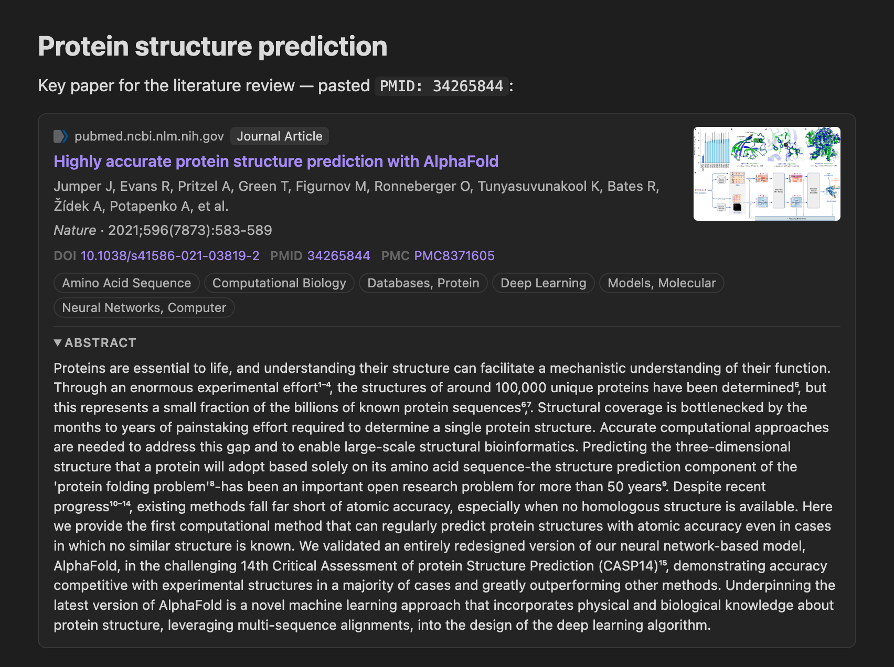

# 🔬 Scientific Article Card

> Created by **[Kirsley Chennen](https://github.com/kchennen)**

📄 Turn a **PMID, PMCID, DOI, arXiv ID or scientific article URL** into a rich metadata card in your notes: title, authors, journal, year/volume/issue/pages, abstract, preview image, DOI, PMID, PMCID and keywords.



💡 Think [Auto Card Link](https://github.com/nekoshita/obsidian-auto-card-link), but for papers: instead of a generic web preview, metadata comes from scholarly databases.

````
```paper
url: "https://pubmed.ncbi.nlm.nih.gov/34265844/"
title: "Highly accurate protein structure prediction with AlphaFold"
authors: "Jumper J, Evans R, Pritzel A, Green T, Figurnov M, Ronneberger O, Tunyasuvunakool K, Bates R, Žídek A, Potapenko A, et al."
journal: "Nature"
year: "2021"
volume: "596"
issue: "7873"
pages: "583-589"
doi: "10.1038/s41586-021-03819-2"
pmid: "34265844"
pmcid: "PMC8371605"
type: "Journal Article"
host: "pubmed.ncbi.nlm.nih.gov"
abstract: "Proteins are essential to life, and understanding their structure can facilitate…"
```
````

The block is rendered as a card with the site icon, publication type, linked title, authors, citation, clickable DOI / PMID / PMC / arXiv links, keyword chips and a collapsible abstract (structured abstracts keep their *Background / Methods / Results* sections). Because it is plain YAML, you can edit any field by hand.

## 🔎 Supported inputs

| Input | Examples |
| --- | --- |
| PMID | `PMID: 34265844`, `34265844` (commands), `https://pubmed.ncbi.nlm.nih.gov/34265844/` |
| PMCID | `PMC8371605`, `https://pmc.ncbi.nlm.nih.gov/articles/PMC8371605/`, Europe PMC links |
| DOI | `10.1038/s41586-021-03819-2`, `doi:…`, `https://doi.org/…` |
| arXiv | `arXiv:1706.03762`, `https://arxiv.org/abs/1706.03762`, `…/pdf/1706.03762v7` |
| Publisher URL | any URL containing a DOI (Science, Wiley, PLOS, Frontiers, bioRxiv/medRxiv, PNAS…), `nature.com/articles/…` |
| Any article page | pages exposing `citation_*` / Dublin Core / OpenGraph meta tags |

Markdown links (`[text](url)`) and `<url>` are accepted too. Trailing `/full`, `.pdf`, `v2` and similar suffixes are stripped from DOIs.

## 🚀 Usage

- 📋 **Paste**: with *Enhance default paste* on, pasting a PubMed/PMC/DOI/arXiv link, a DOI, `PMID: …`, or a URL from a listed publisher domain creates a card. Other URLs are left untouched (so it coexists with Auto Card Link).
- ⌨️ **Commands**
  - *Paste identifier / URL as article card*
  - *Convert selection (or identifier under cursor) to article card* — accepts several identifiers separated by spaces, commas or new lines
  - *Insert article card from PMID / DOI / URL…* — opens a prompt
- 🖱️ **Editor context menu**: *Paste as article card*, *Convert to article card*.

## 🎨 Output formats

- 🃏 **Card** (default): a `paper` code block rendered by the plugin.
- 📝 **Markdown template**: plain Markdown that stays readable without the plugin. The default template is a collapsible callout; customize it with placeholders:

  `{{title}} {{authors}} {{firstAuthor}} {{journal}} {{journalAbbr}} {{year}} {{date}} {{volume}} {{issue}} {{pages}} {{citation}} {{doi}} {{pmid}} {{pmcid}} {{arxiv}} {{ids}} {{url}} {{host}} {{image}} {{type}} {{publisher}} {{keywords}} {{abstract}}`

  Wrap text in `{{#key}}…{{/key}}` to include it only when `key` has a value.

## ⚙️ Settings

Main link target (what you pasted / DOI / PubMed), author format (`Smith JA` or `John A. Smith`), maximum authors before *et al.*, include abstract / keywords / MeSH terms, fetch preview image, expand abstract by default, publisher domains for paste, contact email and NCBI API key.

## 🌐 Network use

This plugin makes network requests **only when you convert an identifier** into a card. It sends the identifier (PMID, PMCID, DOI, arXiv ID or URL) to:

- [NCBI E-utilities / PubMed](https://www.ncbi.nlm.nih.gov/books/NBK25497/) — article metadata by PMID
- [Europe PMC REST API](https://europepmc.org/RestfulWebService) — metadata by DOI / PMCID / PMID
- [Crossref REST API](https://www.crossref.org/documentation/retrieve-metadata/rest-api/) — metadata for DOIs not indexed in Europe PMC
- [arXiv API](https://info.arxiv.org/help/api/index.html) — arXiv preprints
- the article's own page (the URL you pasted, or its `doi.org` landing page) — to read citation meta tags and the preview image
- Google's favicon service (`www.google.com/s2/favicons`) — the site icon displayed on the card, loaded when the card is rendered

If you enter a contact email or NCBI API key in the settings, they are sent to NCBI (and the email to Crossref) as recommended by their usage policies. No other data is collected or transmitted, and there is no telemetry.

## 📦 Installation

🧩 From Obsidian: **Settings → Community plugins → Browse**, search for *Scientific Article Card*.

🛠️ Manually: download `main.js`, `manifest.json` and `styles.css` from the [latest release](https://github.com/kchennen/obsidian-scientific-article-card/releases/latest) into `<vault>/.obsidian/plugins/scientific-article-card/`, then enable the plugin.

## ⚠️ Known limitations

- Some publishers (e.g. Elsevier / ScienceDirect) block automated page requests. Paste the DOI or PMID instead of the page URL.
- The preview image comes from the publisher page and is best effort.

## 👤 Author

**Kirsley Chennen** — [@kchennen](https://github.com/kchennen)

Issues and suggestions are welcome on the [issue tracker](https://github.com/kchennen/obsidian-scientific-article-card/issues). ⭐ Star the repo if you find it useful!

## 📜 License

[MIT](LICENSE) © 2026 Kirsley Chennen
